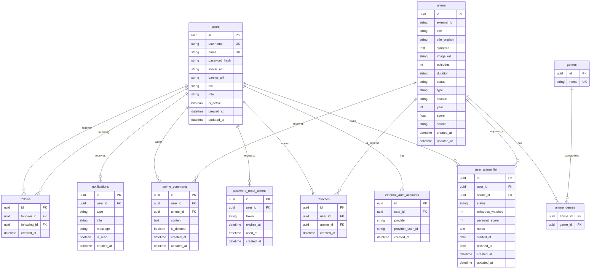

# Diagrama ER

## Notas de Implementación

- `user_anime_list` representa la biblioteca personal.
- Las funcionalidades de episodios, comentarios por episodio y reseñas pueden añadirse en una fase posterior.
- `favorites` y `user_anime_list` son relaciones separadas para permitir que un anime favorito no necesariamente dependa del estado de biblioteca, aunque se puede exigir existencia previa según regla de negocio.

## Referencias Relacionadas

- [[Diseño Lógico]]
- [[Diccionario de Datos]]
- [[Modelo Conceptual]]
