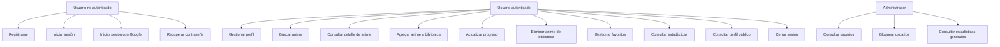

# Casos de Uso - Vista General

```mermaid
flowchart TB
    Visitor[Usuario no autenticado]
    User[Usuario autenticado]
    Admin[Administrador]

    UC01[Registrarse]
    UC02[Iniciar sesión]
    UC03[Iniciar sesión con Google]
    UC04[Recuperar contraseña]

    UC05[Gestionar perfil]
    UC06[Buscar anime]
    UC07[Consultar detalle de anime]
    UC08[Agregar anime a biblioteca]
    UC09[Actualizar progreso]
    UC10[Eliminar anime de biblioteca]
    UC11[Gestionar favoritos]
    UC12[Consultar estadísticas]
    UC13[Consultar perfil público]
    UC14[Cerrar sesión]

    UC15[Consultar usuarios]
    UC16[Bloquear usuarios]
    UC17[Consultar estadísticas generales]

    Visitor --> UC01
    Visitor --> UC02
    Visitor --> UC03
    Visitor --> UC04

    User --> UC05
    User --> UC06
    User --> UC07
    User --> UC08
    User --> UC09
    User --> UC10
    User --> UC11
    User --> UC12
    User --> UC13
    User --> UC14

    Admin --> UC15
    Admin --> UC16
    Admin --> UC17
```

## Referencias Relacionadas

- [[Casos de Uso]]
- [[Usuarios y Roles]]
