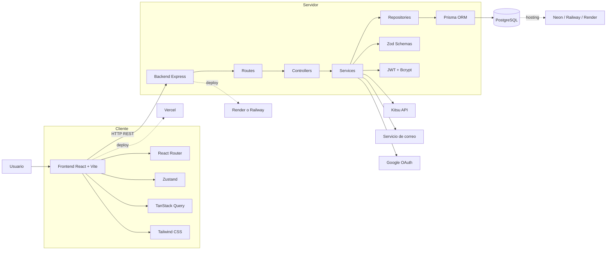

# Diagrama de Arquitectura

```mermaid
flowchart LR
    User[Usuario] --> Frontend[Frontend React + Vite]

    subgraph Client[Cliente]
        Frontend --> Router[React Router]
        Frontend --> State[Zustand]
        Frontend --> Query[TanStack Query]
        Frontend --> UI[Tailwind CSS]
    end

    Frontend -->|HTTP REST| API[Backend Express]

    subgraph Backend[Servidor]
        API --> Routes[Routes]
        Routes --> Controllers[Controllers]
        Controllers --> Services[Services]
        Services --> Repositories[Repositories]
        Services --> Validation[Zod Schemas]
        Services --> Auth[JWT + Bcrypt]
        Repositories --> Prisma[Prisma ORM]
    end

    Prisma --> DB[(PostgreSQL)]
    Services --> AnimeAPI[Kitsu API]
    Services --> Email[Servicio de correo]
    Services --> Google[Google OAuth]

    Frontend -. deploy .-> Vercel[Vercel]
    API -. deploy .-> Render[Render o Railway]
    DB -. hosting .-> Neon[Neon / Railway / Render]
```

## Referencias Relacionadas

- [[Arquitectura del Sistema]]
- [[Backend]]
- [[Frontend]]
- [[Despliegue]]
