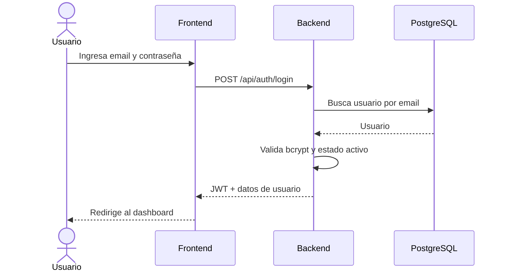
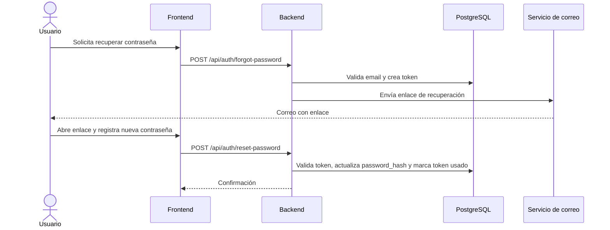
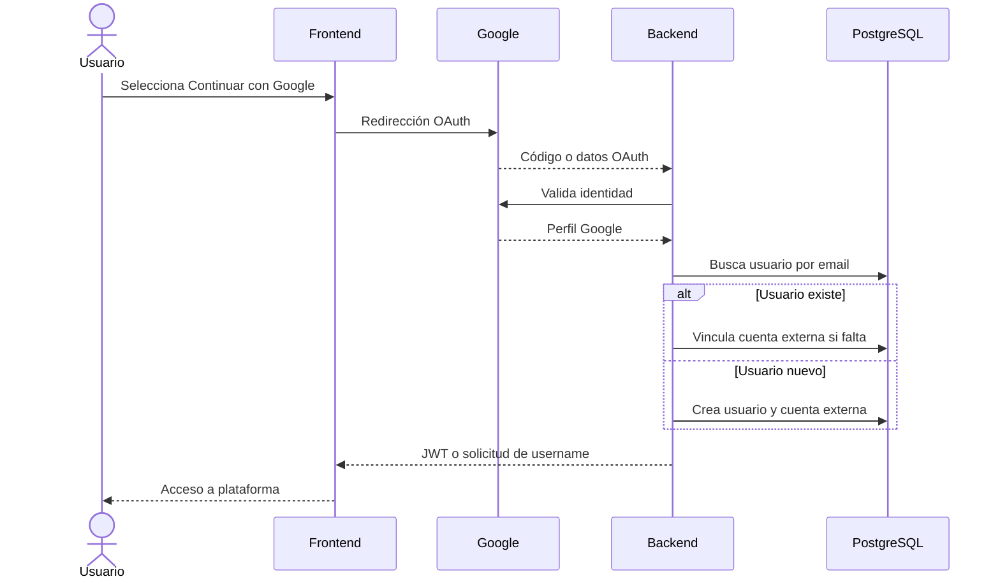

# Flujos de Autenticación

## Login con Email y Contraseña

## Recuperación de Contraseña

## Login con Google

## Referencias Relacionadas

- [[Autenticación y Seguridad]]
- [[Requisitos Funcionales]]
- [[Reglas de Negocio]]
