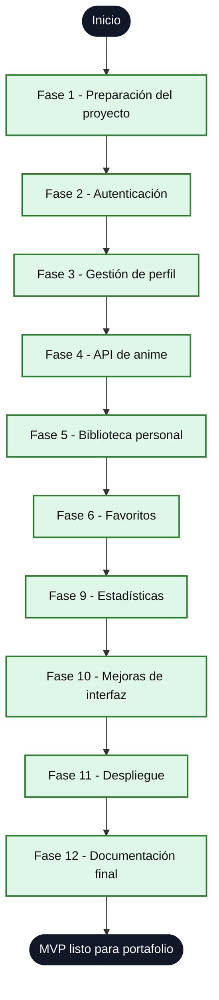
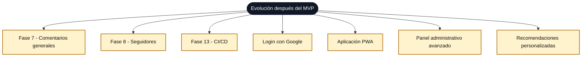

# Roadmap Visual

Esta versión usa diagramas verticales para evitar que Obsidian reduzca demasiado la escala. El scroll se hace con el desplazamiento normal de la nota.

## Roadmap Completo

```mermaid
flowchart TD
    F1["Fase 1: Preparación del proyecto<br/>Frontend, backend, PostgreSQL, Prisma, Docker, ESLint y estructura base"]
    F2["Fase 2: Sistema de autenticación<br/>Registro, login, logout, bcrypt, JWT, middleware y recuperación de contraseña"]
    F3["Fase 3: Gestión de perfil<br/>Perfil privado, edición, avatar, banner, biografía y perfil público"]
    F4["Fase 4: Integración con API de anime<br/>Jikan API, búsqueda, detalle, manejo de errores y paginación"]
    F5["Fase 5: Biblioteca personal<br/>Agregar anime, estado, progreso, calificación, notas y eliminación"]
    F6["Fase 6: Favoritos<br/>Agregar, eliminar y mostrar favoritos en perfil"]
    F7["Fase 7: Comentarios generales<br/>Crear, editar, eliminar y mostrar comentarios por anime"]
    F8["Fase 8: Seguidores<br/>Seguir usuarios, dejar de seguir, seguidores y seguidos"]
    F9["Fase 9: Estadísticas<br/>Completados, episodios vistos, promedio, géneros y distribución por estado"]
    F10["Fase 10: Mejoras de interfaz<br/>Responsive, skeleton loaders, estados de carga, vacíos y accesibilidad"]
    F11["Fase 11: Despliegue<br/>Frontend, backend, PostgreSQL, variables de entorno y pruebas"]
    F12["Fase 12: Documentación final<br/>README, capturas, diagrama ER, arquitectura, instalación y deploy"]
    F13["Fase 13: CI/CD<br/>GitHub Actions, linters, pruebas, builds, despliegue automático y protección de ramas"]

    F1 --> F2 --> F3 --> F4 --> F5 --> F6 --> F7 --> F8 --> F9 --> F10 --> F11 --> F12 --> F13

    classDef mvp fill:#dff7e8,stroke:#2e7d32,stroke-width:2px,color:#111;
    classDef future fill:#fff3cd,stroke:#b7791f,stroke-width:2px,color:#111;
    classDef polish fill:#e8f1ff,stroke:#2f5f9f,stroke-width:2px,color:#111;

    class F1,F2,F3,F4,F5,F6,F9,F10,F11,F12 mvp;
    class F7,F8,F13 future;
```

## MVP Recomendado

## Post-MVP

## Referencias Relacionadas

- [[Roadmap de Desarrollo]]
- [[Plan de Sprints]]
- [[MVP]]
- [[Funcionalidades Futuras]]
